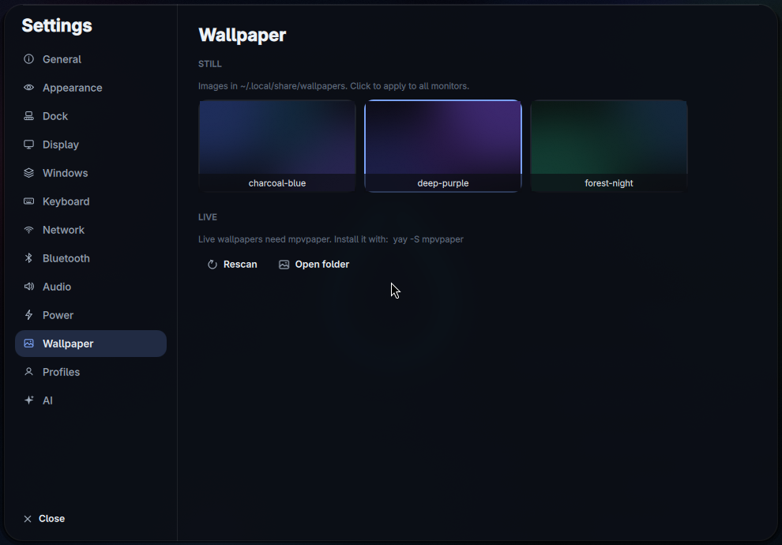
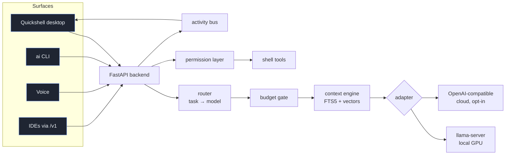

<p align="center"></p>
<h1 align="center">Praxis</h1>
<p align="center"><i>knowledge, put into action</i></p>
<p align="center"><b>An Arch-based Linux desktop with a local-first AI built in.</b><br>
Boot it from a USB stick, try it, install it next to Windows — then ask your computer questions, offline.</p>

<p align="center">
  <a href="https://github.com/MrMehulkhanna/praxis/actions/workflows/ci.yml"></a>
  
  
  
  
  
  
  
</p>

---

Most "AI desktops" are a chat box bolted onto a window manager. Praxis is built the other way round:
a small backend owns a **context store**, a **model gateway**, a **permission layer** and a **usage
ledger** — and every surface (the Wayland shell, a browser UI, a CLI, voice) is just a client of it.
Pick a model once and it applies everywhere. Nothing leaves the machine unless you add a cloud key.

It is developed on a 16 GB laptop with a **6 GB** GPU — the constraint behind most design decisions —
but nothing in the image assumes that machine: GPU drivers, model offload, brightness limits and the
hardware panels all adapt to the computer it is installed on.

## Get it

1. **Download** the ISO from [Releases](https://github.com/MrMehulkhanna/praxis/releases) (≈ 1.9 GB) — or build it yourself on Arch:
   `bash iso/build.sh` (≈ 5 min with a warm package cache).
2. **Write it to a USB drive:** `bash iso/flash.sh praxis-*.iso` — refuses anything that isn't a USB disk,
   wipes the old partition table, writes, then reads the drive back and compares checksums.
3. **Boot** it (UEFI, Secure Boot off). The live desktop logs in as `praxis` / `praxis`.
4. Click **Install Praxis Linux** in the dock:
   - connects Wi-Fi first (and Bluetooth, if you want) — the install downloads current packages;
   - detects CPU microcode and GPU drivers by PCI vendor ID (Intel, AMD, NVIDIA — including hybrid laptops
     and pre-Turing cards, which get the open-source stack);
   - **keeps Windows**: it installs only into unallocated space (≥ 30 GiB) with GRUB + os-prober, or wipes a
     disk you choose after you type `PROCEED`;
   - installs exactly the desktop you just tried, from the same package list.
5. After the first login, `aios-setup` installs the AI backend and `praxis-models recommend` suggests models
   that fit your GPU.

## The desktop

<p align="center"></p>

| | |
|---|---|
| **Shell** | Qt 6/QML on [Quickshell](https://quickshell.org): responsive top bar, dock (auto-hide, fullscreen-aware), launcher & command palette, Control Center, StandBy-style widget board, a 12-desk overview, notifications. |
| **Settings that do real things** | Wi-Fi and Bluetooth over D-Bus, PipeWire devices, brightness (with an OLED-safe floor only on OLED panels), power profiles, keyboard backlight and charge limit where the laptop has them, and an ASUS **GPU mode** switch (Hybrid: the NVIDIA GPU sleeps until something needs it). |
| **Task manager** | `Ctrl+Shift+Esc`: *current* CPU per process, per-process GPU use from the kernel's DRM counters and `nvidia-smi` (never waking a sleeping GPU), and a ✕ that really stops a task and its children — polite `SIGTERM`, then `SIGKILL`. Running AI jobs get a Stop button that frees the GPU at once. |
| **Live wallpapers** | Three procedurally rendered, seamless loops. One decoder for every monitor with hardware decode: ~3 % CPU on the dev laptop. Pauses when covered, shows the still image on battery. |
| **Voice** | Push-to-talk → Whisper → a default-deny allow-list of commands ("turn the volume up", "open Firefox", "lock the screen"); everything else is a question for the AI, answered aloud with Piper. |

<p align="center">
  
  
  
</p>

**Keys:** `Super+Space` palette · `Super+A` launcher · `Super+I` AI · `Super+O` Control Center ·
`Super+B` widgets · `Super+Tab` desks · `Ctrl+Shift+Esc` tasks · `Super+N` quick note ·
`Super+Shift+O` OCR · `Print` screenshot · `Super+Esc` restart the shell.

---

## Engineering highlights

The parts worth reading, and why they're built that way.

### Context engine — retrieval under a token budget
`src/core/context/engine.py`
Naively you send the whole conversation; it gets expensive and worse over time. Instead: retrieve
candidates from SQLite FTS5, score them `0.45·BM25 + 0.25·recency + 0.30·importance`, dedup, and
**stop early** once the budget is met — hard-capped at 50% of the context window, recent turns at 25%.

### Model gateway — provider independence
`src/core/gateway/`, `src/adapters/`
One `Adapter` protocol. A local llama.cpp adapter — which sizes the GPU offload to the machine's free
VRAM — plus a generic OpenAI-compatible adapter that serves 8 cloud providers from a JSON config.

### Stopping work for real
`src/core/activity.py`
A stop races every pending token read against a cancel event, so it takes effect even during prompt
processing; cancelling the read closes the stream, and llama-server stops computing. A client that
disconnects mid-answer can no longer leave a job "running" forever — that cancellation used to skip
every clean-up path. Tests pin all of it.

### Cost safety as structure, not a flag
`src/core/gateway/gate.py`
A paid provider is **unreachable** unless the budget mode allows it — the check sits at a choke point
every request crosses, before any HTTP request is built.

### Default-deny permissions for AI-generated commands
`src/core/perms/policy.py`, `src/core/tools/exec.py`, `voice/`
The model proposes one shell command; a classifier sorts it **auto / confirm / forbidden**. A command
must positively match a safe allow-list to run unattended; read-only commands are demoted the moment
their output is redirected. Voice has its own allow-list. Every decision lands in an audit table.

### An installer that other people can trust
`iso/`, `tests/iso_checks.sh`
The ISO is built from this repository by `iso/build.sh`. ~100 checks run on every push: GPU detection
against real `lspci` lines (including hybrid laptops whose iGPU is a "Display controller"), free-space
detection, installer guards, installed-system/live-session package parity, every package the installer
will request existing, keybinds calling only shipped tools, and the live image's network and SSH policy.

## Architecture



Independent modules under `src/core/`: `store` · `context` · `gateway` · `providers` · `router` ·
`perms` · `tools` · `agent` · `activity` · `hardware` · `voice` · `rag`.

## The CLI

```console
$ ai "check my GPU and memory"        # agent — gathers real diagnostics, then answers
$ ai code "add a retry to this fn"    # routes to a coding-capable model, adds cwd + git context
$ ai see diagram.png "what's wrong?"  # local vision model
$ ai do "set volume to 40%"           # permission-gated system control
$ ai rag add ~/notes; ai rag q "…"    # your own documents, retrieved locally
$ ai doctor                           # health check for this machine
```

## Layout

```
src/        FastAPI backend (core/ modules + adapters/)
ai          the CLI
voice/      push-to-talk pipeline + default-deny command allow-list
desktop/    Quickshell shell, Hyprland/swaync/rofi config, wallpapers (still + live)
iso/        archiso profile overlay, build/flash/publish scripts, installer
tests/      pytest (backend, voice) + iso_checks.sh
tools/      live-wallpaper renderer, hardware helper, desk tracker
```

## Develop

On an existing Arch + Hyprland system:

```bash
python -m venv .venv && .venv/bin/pip install -r requirements.txt
cp config/aios.env.example config/aios.env && chmod 600 config/aios.env
systemctl --user enable --now aios.service
.venv/bin/python -m pytest tests/ && bash tests/iso_checks.sh
```

`ai doctor` names anything missing. `docs/selftest.sh` runs 21 end-to-end checks on a live system.

## Principles

Local-first · model-agnostic · context-centric · cost-aware · offline-capable · user-controlled ·
modular · transparent. No hidden automation, no telemetry.

## License

MIT — see [`LICENSE`](LICENSE). Model weights, `llama.cpp` and the packages in the ISO are separate
projects under their own licenses. Praxis is an unofficial project and is not affiliated with Arch Linux.
